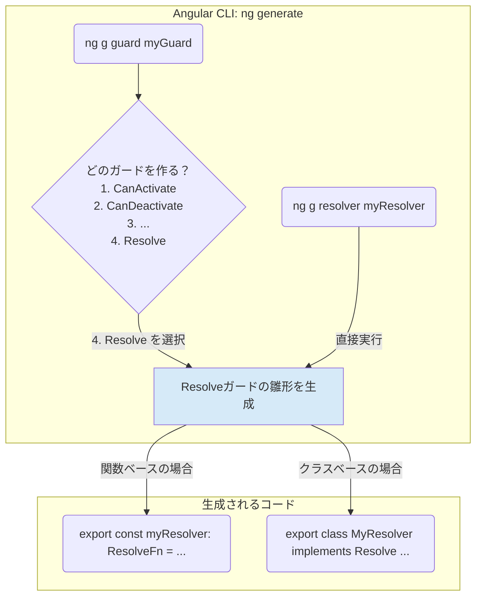

### 1. Resolver と Resolveガード：結論から言うと「同じもの」

まず結論から申し上げます。

**「Resolver」と「Resolve ガード」は、実質的に同じものを指しています。**

より正確に言えば、`Resolve` はガードの一種であり、`Resolve` インターフェースを実装したクラスや関数のことを一般的に **Resolver (リゾルバー)** と呼びます。

*   **ガード (Guard)**: ルーティングにおける「門番」の**総称**です。`CanActivate`, `CanDeactivate`, `Resolve` など、複数の種類があります。
*   **Resolve ガード**: ガードという大きなカテゴリの中の、**「データ解決」を担当する特定の種類**の名前です。
*   **Resolver**: `Resolve` の役割を担うために**具体的に実装されたクラスや関数のこと**を指す呼び名です。

**例えるなら…**

*   **ガード**: 「警察官」という職業の総称。
*   **Resolve ガード**: 警察官の中の「交通課の警察官」という特定の役割。
*   **Resolver**: 交通課に所属している「田中さん」という具体的な人物。

つまり、あなたが `UserResolver` というクラスを作った場合、それは「Resolver」であり、同時に「Resolve ガード」として機能している、ということです。文脈によって呼び方が変わるだけで、指している機能や概念は同じです。

---

### 2. Angular CLI のコマンド体系 (`ng generate`)

ここが混乱の元なのですが、Angular CLI のコマンド体系は、Angular のバージョンアップと共に少しずつ変化してきました。

#### 歴史的経緯と現在の状況

*   **昔 (Angular v14以前など)**:
    *   `ng generate guard <名前>`: このコマンドを実行すると、対話形式でどの種類のガードを作成するか尋ねられました。ここで `Resolve` を選択することで、Resolver を作成できました。
    *   `ng generate resolver <名前>`: こちらは Resolver を直接作成するための専用コマンドでした。

*   **現在 (Angular v15以降の推奨)**:
    *   Angular チームは、よりシンプルで関数ベースの「関数型ガード (Functional Guards)」を推奨するようになりました。これに伴い、CLI の体系も整理されました。
    *   **`ng generate guard <名前>`**: このコマンドが**主流**となりました。実行すると、どの種類のガードを作成するか聞かれ、`CanActivate` や `Resolve` を選択します。そして、クラスベースか関数ベースかも選択できます。
    *   **`ng generate resolver <名前>`**: このコマンドも引き続き利用可能ですが、実質的には `ng g guard` で `Resolve` を選ぶのと同じ結果になります。役割としては **Resolver を作成するためのショートカットコマンド**という位置づけです。

#### CLI コマンドの関係図



**解説:**

*   `ng g guard` は、**すべての種類のガードを作成するための統一的な入り口**です。
*   `ng g resolver` は、`ng g guard` で `Resolve` を選択する手間を省くための、**便利な別名（エイリアス）またはショートカット**と考えるのが最もわかりやすいでしょう。

どちらのコマンドを使っても、最終的に生成される「`Resolve` の役割を持つコード」は同じです。
したがって、

---

### 3. 実践的な使い分けと推奨

*   **これから学ぶなら**: `ng g guard` の使い方を覚えておけば十分です。この一つのコマンドで全てのガードに対応できるため、覚えることが少なくて済みます。
*   **関数型ガードを推奨**: Angular v15以降、公式では関数ベースの実装が推奨されています。コードがより簡潔になり、DI (依存性の注入) も `inject()` 関数を使ってシンプルに行えます。

#### 関数型 Resolver の例 (`ng g guard` で生成)

CLI で `ng g guard User --functional` と実行し、`Resolve` を選択すると、以下のようなコードが生成されます。

```typescript
// user.resolver.ts
import { inject } from '@angular/core';
import { ResolveFn, Router } from '@angular/router';
import { UserService } from './user.service';
import { User } from './user.model';
import { of } from 'rxjs';
import { catchError } from 'rxjs/operators';

// ResolveFn<T> の T は解決したいデータの型
export const userResolver: ResolveFn<User | null> = (route, state) => {
  // クラスのコンストラクタインジェクションの代わりに inject() を使う
  const userService = inject(UserService);
  const router = inject(Router);

  const id = route.paramMap.get('id');

  if (!id) {
    router.navigate(['/404']);
    return null; // or of(null)
  }

  return userService.getUserById(id).pipe(
    catchError(error => {
      console.error('Resolver error:', error);
      router.navigate(['/404']);
      return of(null); // エラー時はnullを解決する
    })
  );
};
```

この関数をルーティング設定で使う方法は、クラスベースの場合とほぼ同じです。

```typescript
// app-routing.module.ts
import { userResolver } from './user.resolver';

const routes: Routes = [
  {
    path: 'users/:id',
    component: UserDetailComponent,
    resolve: {
      user: userResolver // クラスではなく、エクスポートされた関数を直接指定
    }
  }
];
```

### まとめ

| 用語/コマンド | 位置づけと解説 |
| :--- | :--- |
| **ガード (Guard)** | ルーティングの門番の**総称**。 |
| **Resolve ガード** | ガードの中の一種で、**データ解決**を担当。 |
| **Resolver** | `Resolve` の役割を果たすために実装された**具体的なコード（クラス/関数）**のこと。実質、Resolveガードと同義。 |
| **`ng g guard`** | **すべてのガードを作成するための統一コマンド**。対話形式で種類を選ぶ。こちらを覚えておくのがおすすめ。 |
| **`ng g resolver`** | Resolve ガード（Resolver）を作成するための**専用ショートカットコマンド**。 |

この整理により、用語とCLIコマンドの関係が明確になったかと思います。基本的には「`Resolve` という種類のガードを、`ng g guard` コマンドで作る」と覚えておけば、迷うことはありません。