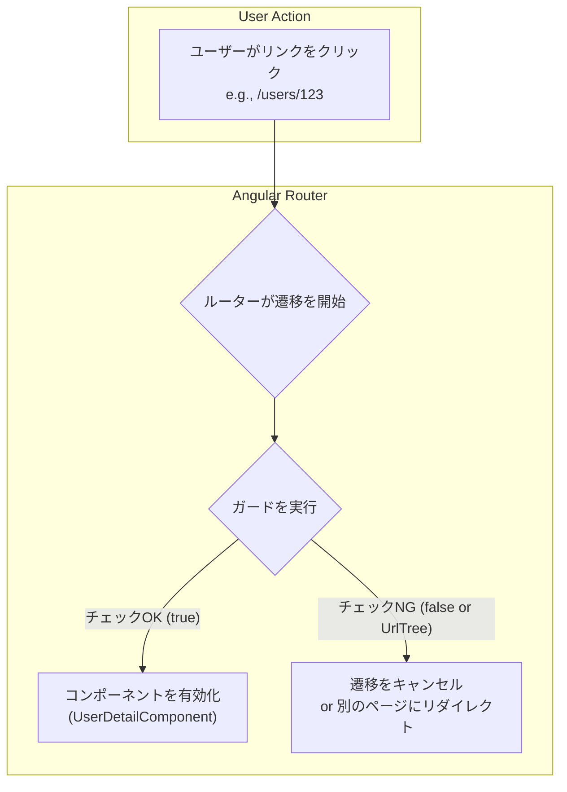

> [!NOTE]
> 本コンテンツは [[親子コンポーネント状態共有のベストプラクティス]] 第3章: 「よりAngularらしい解決策 - 共有サービスと`resolve`ガード」の補足です。

### 1. そもそもガード (Guard) とは？ - ルーティングの門番

まず、`resolve` を理解する前提として、Angular Router における「ガード」の概念を把握する必要があります。

ガードとは、その名の通り、**特定のルート (URL) への遷移を「許可」または「拒否」するための門番**のような役割を持つクラスです。ユーザーがあるページにアクセスしようとしたとき、実際にそのページのコンポーネントが表示される**前**に、特定の条件をチェックする仕組みを提供します。

#### 関係図：ルーターとガード



ガードにはいくつかの種類があり、それぞれチェックするタイミングが異なります。

| ガードの種類 | 役割 | 典型的なユースケース |
| :--- | :--- | :--- |
| **`CanActivate`** | **ルートへの進入を許可するか？** | ユーザーがログインしているかチェックし、していなければログインページにリダイレクトする。 |
| **`CanDeactivate`** | **ルートから離脱するのを許可するか？** | ユーザーが入力中のフォームを保存せずにページを離れようとしたときに、「変更が失われますがよろしいですか？」と確認ダイアログを表示する。 |
| **`CanLoad`** | **遅延読み込みモジュールをロードするか？** | 特定の権限を持つユーザーにのみ、管理者用モジュールをダウンロードさせる。 |
| **`Resolve`** | **ルートを有効化する前に、必要なデータを取得する。** | これから詳しく解説します。 |

このように、ガードは「～できるか？(`Can...`)」を判断するセキュリティチェックや、「～を解決する(`Resolve`)」というデータ準備の役割を担い、ルーティングのプロセスに介入します。
    
---

### 2. `resolve` ガードの役割 - "先回り" データフェッチ

`CanActivate` などが「セキュリティチェック」の門番だとすれば、`resolve` は「**おもてなしの準備係**」の門番です。

`resolve` ガードの主な目的は、**コンポーネントが初期化される前に、そのコンポーネントが表示に必要なデータを非同期で取得（解決）しておくこと**です。

#### なぜ `resolve` が必要なのか？ - `ngOnInit` でのデータ取得との比較

通常、コンポーネントが表示に必要なデータは、コンポーネント自身の `ngOnInit` ライフサイクルフック内で取得することが多いです。

**`ngOnInit` で取得する場合の問題点:**

1.  ユーザーが `/users/123` にアクセスする。
2.  ルーターが `UserDetailComponent` を即座に表示する。
3.  コンポーネントのテンプレートは表示されるが、データがないため、ローディングスピナーやスケルトンスクリーン（骨組みだけのUI）が表示される。
4.  `ngOnInit` が実行され、`UserService` を通じてHTTPリクエストが開始される。
5.  データが取得できたら、ローディング表示を消し、実際のデータを画面に描画する。

このアプローチは一般的ですが、以下のようなデメリットがあります。
*   **中途半端な画面表示**: ユーザーは一瞬、データのない不完全なページを見ることになります。
*   **コンポーネント内の複雑化**: コンポーネント自身がローディング状態の管理（`isLoading` フラグなど）やエラーハンドリングのロジックを持つ必要があります。

**`resolve` を使う場合:**

1.  ユーザーが `/users/123` にアクセスする。
2.  ルーターは `UserDetailComponent` を表示する**前に**、`resolve` ガードを実行する。
3.  `resolve` ガードが `UserService` を通じてHTTPリクエストを開始し、**データ取得が完了するまで遷移を待機させる**。
4.  データが正常に取得できたら、ルーターはそのデータを遷移先に渡し、`UserDetailComponent` を表示する。
5.  `UserDetailComponent` は、初期化された時点で**既にデータを持っている**ため、ローディング状態を管理する必要がなく、最初から完全な状態で画面を表示できる。

#### メリットのまとめ

*   **優れたUX (ユーザー体験)**
    *   データがロードされるまでページ遷移を待機させることができるため、ユーザーは空のコンポーネントや中途半端に描画された画面を一瞬見る、といった不快な体験をせずに済みます。この待機時間中は、グローバルなローディングスピナーなどを表示するのが一般的です。

*   **コンポーネントの責務分離**
    *   コンポーネントは「データ取得のロジック」から解放され、「受け取ったデータを表示する」という本来の責務に集中できます。これにより、コンポーネントのコードはシンプルで、テストしやすくなります。
    *   データ取得ロジックは再利用可能な`Resolver`サービスに集約されます。

*   **エラーハンドリングの集約**
    *   データ取得に失敗した場合（例: APIがエラーを返す、存在しないIDを指定された）、コンポーネントが表示される前にエラーを検知できます。
    *   エラーを`Resolver`内で一元的にハンドリングし、エラーページへリダイレクトしたり、適切なフォールバック処理を行ったりできます。

*   **副作用の実行 (今回のケース)**
    *   APIからのデータ取得だけでなく、「ナビゲーションに連動したアプリケーションの状態更新」という副作用を実行するのにも非常に適しています。私たちのケースでは、ページ遷移に合わせて`HeaderService`のタイトルやボタンの状態を更新しました。

    
---

### 3. どのように実装するのか？

実装は大きく分けて4つのステップになります。

**ステップ1: `Resolver`サービスを作成する**
Angular CLIで雛形を生成します。

```bash
ng generate resolver <Resolver名>
# 例: ng g r user-data
```

生成されたクラスに`@Injectable()`デコレータが付与され、`Resolve`インターフェースを実装していることを確認します。

**ステップ2: `resolve`メソッドを実装する**
`resolve`メソッドがこのガードの本体です。

```typescript
import { Injectable } from '@angular/core';
import { Resolve, ActivatedRouteSnapshot } from '@angular/router';
import { Observable } from 'rxjs';
import { UserService } from './user.service'; // データを取得するサービス

export interface User { id: number; name: string; }

@Injectable({ providedIn: 'root' })
export class UserDataResolver implements Resolve<User> { // <User> は解決されるデータの型

  constructor(private userService: UserService) {}

  resolve(route: ActivatedRouteSnapshot): Observable<User> | Promise<User> | User {
    // URLからユーザーIDを取得 (例: /users/123)
    const userId = route.paramMap.get('id'); 
    
    // サービスを使ってデータを取得し、Observableを返す
    // ルーターは、このObservableが完了するまでナビゲーションを待機する
    return this.userService.getUserById(userId!);
  }
}
```
*   **引数**: `ActivatedRouteSnapshot`から、URLパラメータ (`paramMap`) やクエリパラメータ (`queryParamMap`)、静的データ (`data`) を取得できます。
*   **戻り値**: `Observable`, `Promise`, または静的なデータそのものを返すことができます。ルーターは非同期処理（`Observable`や`Promise`）が完了するのを自動的に待ちます。

**ステップ3: ルーティング設定に登録する**
`app-routing.module.ts`で、`Resolver`を適用したいルートに`resolve`プロパティを追加します。

```typescript
// app-routing.module.ts
const routes: Routes = [
  {
    path: 'users/:id', // URLに:idパラメータを含む
    component: UserDetailComponent,
    resolve: {
      // 'user' というキーで、UserDataResolverの結果をマッピングする
      user: UserDataResolver 
    }
  }
];
```
キー名（この例では`user`）は任意に決めることができ、このキーを使ってコンポーネント側でデータを受け取ります。

**ステップ4: コンポーネントでデータを受け取る**
コンポーネントは`ActivatedRoute`サービスを注入し、`data`プロパティを購読することで`Resolver`が解決したデータを受け取ります。

```typescript
// user-detail.component.ts
import { Component, OnInit } from '@angular/core';
import { ActivatedRoute } from '@angular/router';
import { User } from './user-data.resolver';

@Component({ /* ... */ })
export class UserDetailComponent implements OnInit {
  user$!: Observable<User>;

  constructor(private route: ActivatedRoute) {}

  ngOnInit(): void {
    // this.route.dataはObservableであり、
    // 'user'キーにマッピングされたデータが含まれている
    this.user$ = this.route.data.pipe(
      map(data => data['user']) // 'user'キーでデータを取り出す
    );
    
    // もしくはスナップショットで一度だけ取得することも可能
    // const user: User = this.route.snapshot.data['user'];
    // console.log(user);
  }
}
```

---

### 4. 注意点とベストプラクティス

*   **パフォーマンス**: `resolve`はナビゲーションを**ブロック**します。非常に重い処理や、完了までに時間がかかりすぎるAPIコールをここで行うと、ユーザーは何も表示されない画面で待たされることになり、UXを損ないます。必要に応じてタイムアウト処理を入れたり、スケルトンUI（先に骨格だけ表示する手法）などの代替案も検討しましょう。
*   **必須のエラーハンドリング**: データ取得に失敗した場合、ナビゲーション全体がキャンセルされます。`catchError`などを使ってエラーを捕捉し、「エラーページにリダイレクトする」「nullや空のオブジェクトを返してコンポーネント側で対処する」といった処理を必ず実装してください。

```typescript
// エラーハンドリングの例
resolve(route: ActivatedRouteSnapshot): Observable<User | null> {
  const userId = route.paramMap.get('id');
  return this.userService.getUserById(userId!).pipe(
    catchError(error => {
      console.error('Resolver failed:', error);
      // エラー発生時は /not-found にリダイレクト
      this.router.navigate(['/not-found']); 
      // ナビゲーションをキャンセルするために空のObservableを返す
      return EMPTY; 
    })
  );
}
```

`resolve`ガードは、アプリケーションのデータフローをより宣言的で堅牢にするための強力なツールです。正しく使いこなすことで、コードの品質とユーザー体験の両方を向上させることができます。

> [!NOTE]
> [[Resolverとresolveガードの関係]]