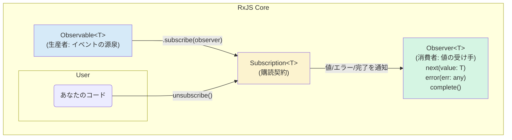
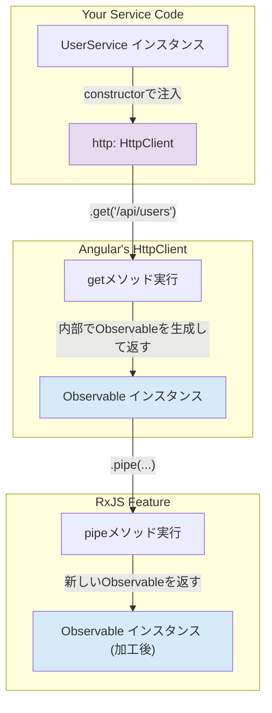
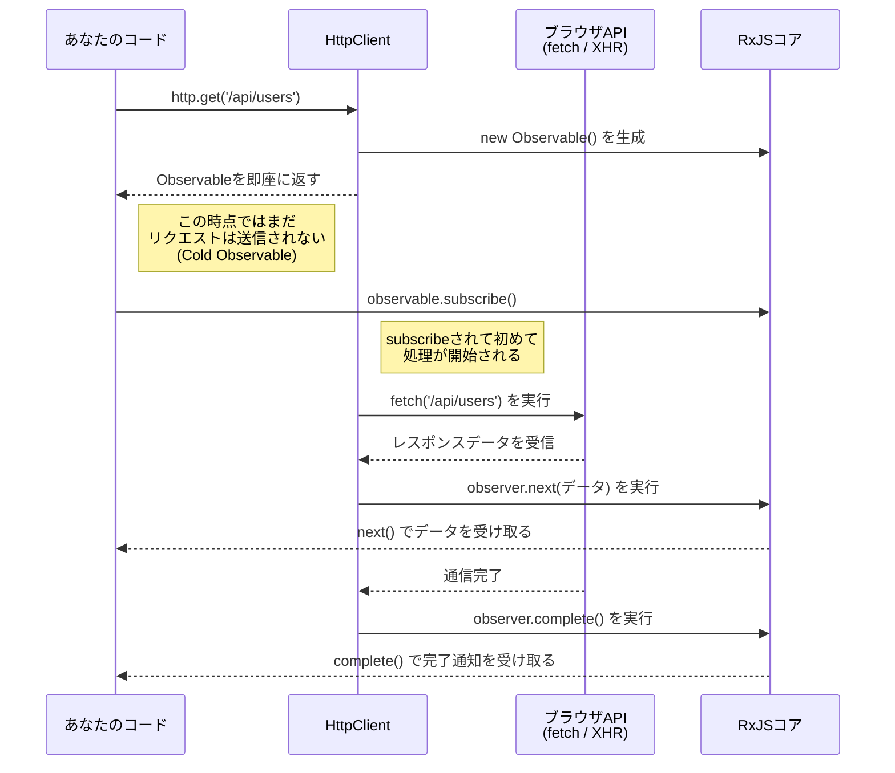
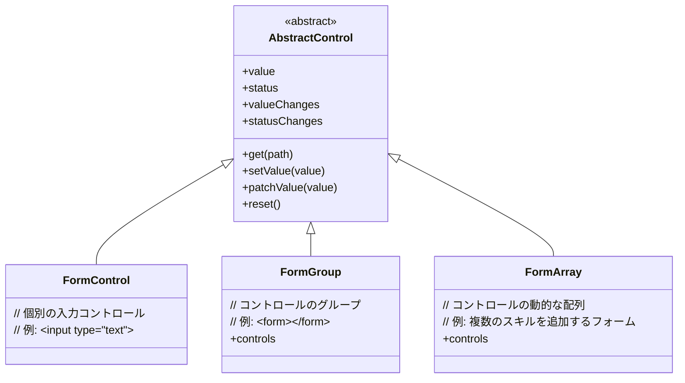

RxJS の**思想、構造、そして「なぜ」そう書くのか**という根幹を理解できるよう、図を交えながら体系的に解説します。この解説を読み終える頃には、Angular コードの中の RxJS が何を意図しているのかを読み解き、自力で学習を進めるための地図を手に入れているはずです。

---

### 1. はじめに：なぜ Angular に RxJS が必要なのか？ - 発想の転換

まず最も重要なのは、RxJS は単なる「非同期処理ライブラリ」ではない、ということです。RxJS は**非同期的なイベントを「データのストリーム」として統一的に扱うためのプログラミングパラダイム（考え方の枠組み）** を提供します。

現代のフロントエンドアプリケーションは、非同期イベントで溢れています。

*   ユーザーのクリック、マウス移動、キーボード入力
*   サーバーからのデータ取得 (HTTP リクエスト)
*   タイマー (setTimeout, setInterval)
*   WebSocket によるリアルタイム通信

これらの多種多様な非同期イベントを、従来の手法（コールバック関数、Promise）で組み合わせようとすると、コードはすぐに複雑化し、いわゆる「コールバック地獄」や状態管理の煩雑さを引き起こします。

RxJS は、これらすべてを **「時間の流れに沿って値が流れてくる川（ストリーム）」** という一つのモデルで表現します。これにより、どんな非同期処理も同じ方法で合成・加工・管理できるようになり、コードは宣言的で、見通しが良くなります。

**Angular が RxJS を全面的に採用しているのは、この「非同期処理の統一的かつ宣言的な扱い」が、複雑化する現代のアプリケーション開発において極めて強力だからです。**

---

### 2. RxJS のコアコンセプト：3つの主役

RxJS の世界は、基本的に3つの登場人物で成り立っています。まず、この関係性を理解することがすべての基本です。

| 登場人物 | 役割 | 例え |
| :--- | :--- | :--- |
| **Observable** | **生産者**。未来に渡される値のストリーム（源泉）。 | 新聞社、YouTube チャンネル |
| **Observer** | **消費者**。Observable から発行された値を受け取る。 | 新聞の読者、チャンネル登録者 |
| **Subscription** | **購読関係**。Observable と Observer の間の接続。購読の停止を担当。 | 新聞の購読契約 |

#### 関係図

これらの関係は、以下の図で表せます。



**解説:**

1.  **Observable (生産者)**: 「これからクリックイベントが発生しますよ」「HTTP レスポンスが返ってきますよ」といった、イベントの発生源です。この時点ではまだ何も起こりません。ただ「こういうデータが流れる可能性があります」と宣言しているだけです。
2.  **`subscribe()` (購読開始)**: あなたのコードが Observable の `subscribe()` メソッドを呼び出すことで、初めてデータの流れが開始されます。このとき、値を受け取るための **Observer (消費者)** を渡します。
3.  **Observer (消費者)**: 3つのメソッドを持つシンプルなオブジェクトです。
    *   `next(value)`: 新しい値がストリームに流れてきたときに呼ばれます。
    *   `error(err)`: ストリームの途中でエラーが発生したときに呼ばれます。
    *   `complete()`: ストリームが正常に終了したときに呼ばれます。
4.  **Subscription (購読契約)**: `subscribe()` を呼ぶと返ってくるオブジェクトです。この購読を途中でやめたい場合（例: コンポーネントが破棄されるとき）、このオブジェクトの `unsubscribe()` メソッドを呼び出します。**これを怠るとメモリリークの原因になるため、極めて重要です。**

---

### 3. データの流れ：ストリームとオペレータ

RxJS の真価は、ストリームを流れるデータを自在に加工できる**オペレータ (Operator)** にあります。

オペレータは、入力ストリームを受け取り、何らかの処理を加えて新しい出力ストリームを返す**純粋関数**です。これらのオペレータを `pipe()` メソッドで繋ぎ合わせる（パイプラインを構築する）ことで、複雑な処理を宣言的に記述します。

#### シーケンス図 (マーブルダイアグラム)

オペレータの動作を理解するには、この図が非常に役立ちます。時間の流れを左から右への矢印で、流れる値を `●` (マーブル) で表現します。

**例：クリックされた座標のうち、x座標が200以上のものだけを10倍して取得する**

```
// 元のクリックイベントストリーム (Observable)
source$:      --c1(x:50)----c2(x:250)----c3(x:300)----c4(x:100)-->

    |
    | pipe(
    |   filter(event => event.x > 200),
    |   map(event => event.x * 10)
    | )
    V

// filter(event => event.x > 200) を通過したストリーム
filtered$:   --------------c2(x:250)----c3(x:300)-------------->

// map(event => event.x * 10) を通過した最終的なストリーム
result$:     --------------(2500)-------(3000)---------------->
```

#### なぜ `pipe()` を使うのか？

`pipe()` は、水道管（パイプ）のようにオペレータを連結するための仕組みです。

```typescript
import { fromEvent } from 'rxjs';
import { map, filter } from 'rxjs/operators';

// 1. イベントストリームの作成 (Observable)
const click$ = fromEvent<MouseEvent>(document, 'click');

// 2. パイプラインを構築して、欲しいデータに変換
const result$ = click$.pipe(
  // マウスイベントから x 座標だけを取り出す
  map(event => event.clientX),
  // x 座標が 200 以上のものだけを通過させる
  filter(x => x >= 200)
);

// 3. 購読して初めてデータが流れ始める
console.log('購読開始前');
const subscription = result$.subscribe({
  next: x => console.log(`x座標: ${x}`),
  error: err => console.error(err),
  complete: () => console.log('完了') // fromEventは通常完了しない
});
console.log('購読開始後');

// 必要に応じて購読を停止する
// subscription.unsubscribe();
```

このコードが「なぜ」優れているのか？
*   **宣言的**: 「クリックされたら、座標を取り出し、200以上ならログに出す」という **「何をしたいか」** がそのままコードになっている。「どのように」イベントリスナーを登録し、条件分岐するかといった手続き的な詳細が隠蔽されている。
*   **合成可能**: もっと複雑な要件（例:「300ミリ秒以内の連続クリックは無視する」）が出てきても、`debounceTime(300)` というオペレータをパイプラインに追加するだけで対応できます。
*   **見通しの良さ**: データが上から下へ、`pipe` の中で順に処理されていく流れが明確です。

---

### 4. オペレータの分類と学習戦略

RxJS には100以上のオペレータがあり、すべてを暗記する必要はありません。重要なのは、**「何をしたいか」に応じて適切なオペレータを探せる能力**です。そのために、オペレータをカテゴリで捉えましょう。

| カテゴリ | 役割 | 代表的なオペレータ | ユースケース例 |
| :--- | :--- | :--- | :--- |
| **生成** | 新しい Observable を作る | `of`, `from`, `fromEvent`, `interval` | 固定値、配列、イベント、タイマーからストリームを開始する |
| **変換** | 流れてくる値を加工・変換する | `map`, `scan`, `switchMap`, `mergeMap` | データを別の形式に整形する、値を使って別の非同期処理を呼ぶ |
| **フィルタリング** | 条件に合う値だけを通す | `filter`, `take`, `debounceTime`, `distinctUntilChanged` | 不要なデータを除外する、最初のN件だけ取得、入力確定を待つ |
| **結合** | 複数の Observable を一つにまとめる | `merge`, `concat`, `zip`, `combineLatest` | 複数のデータソースを同時に扱う、順序を保証して結合する |
| **エラー処理** | エラー発生時の振る舞いを定義する | `catchError`, `retry` | エラーを補足して代替値を返す、処理をリトライする |
| **ユーティリティ** | デバッグや副作用の実行 | `tap`, `delay` | ストリームに影響を与えずに値を覗き見る（デバッグに最適） |

**学習戦略:**

1.  **各カテゴリの代表選手を1つずつマスターする**: まずは `map`, `filter`, `tap`, `switchMap`, `catchError` を中心に使い方を覚えましょう。
2.  **「やりたいこと」で検索する**: 「フォーム入力が終わってから検索したい」→「rxjs debounce input」のように検索すると `debounceTime` が見つかります。
3.  **公式ドキュメントとマーブルダイアグラムを活用する**: [rxjs.dev](https://rxjs.dev/) には全オペレータの解説と、動きが視覚的にわかるマーブルダイアグラムがあります。未知のオペレータは、まずこの図を見て動きを理解するのが最も早道です。

---

### 5. Angular での RxJS 実践パターン

Angular のコードで RxJS に出会ったとき、それは大抵以下のパターンのいずれかです。このパターンを知っているだけで、コードの意図が格段に読みやすくなります。

#### パターン1: `HttpClient` と `catchError` (非同期データ取得)

Angular の `HttpClient` は、HTTPリクエストの結果を `Observable` として返します。

```typescript
// user.service.ts
import { HttpClient } from '@angular/common/http';
import { catchError } from 'rxjs/operators';
import { of } from 'rxjs'; // 代替値を返すためのObservableを作成

@Injectable({ providedIn: 'root' })
export class UserService {
  constructor(private http: HttpClient) {}

  getUsers() {
    return this.http.get<User[]>('/api/users').pipe(
      // エラーが発生した場合、このパイプラインで捕捉する
      catchError(error => {
        console.error('ユーザーの取得に失敗しました', error);
        // アプリケーションをクラッシュさせず、安全な値（空の配列）を代わりに流す
        return of([]);
      })
    );
  }
}
```

*   **なぜこう書く？**: HTTP通信は失敗がつきものです。`pipe` と `catchError` を使うことで、データ取得からエラーハンドリングまでを一連の流れとして記述できます。コンポーネント側は成功時も失敗時も `Observable` を受け取れるため、ロジックがシンプルになります。

#### パターン2: `AsyncPipe` (購読と破棄の自動化)

これは **Angular x RxJS で最も重要かつ強力なパターン**です。`subscribe` と `unsubscribe` の管理を Angular に完全に任せることができます。

```typescript
// user-list.component.ts
import { Component, OnInit } from '@angular/core';
import { Observable } from 'rxjs';
import { UserService } from './user.service';

@Component({
  selector: 'app-user-list',
  template: `
    <!-- "user$" の末尾の $ は Observable であることを示す慣習 -->
    <!-- AsyncPipe (| async) が自動で subscribe/unsubscribe してくれる -->
    <div *ngIf="users$ | async as users; else loading">
      <ul>
        <li *ngFor="let user of users">{{ user.name }}</li>
      </ul>
    </div>
    <ng-template #loading>Loading users...</ng-template>
  `
})
export class UserListComponent implements OnInit {
  // Observable を直接プロパティとして持つ
  users$!: Observable<User[]>;

  constructor(private userService: UserService) {}

  ngOnInit() {
    this.users$ = this.userService.getUsers();
  }
}
```

*   **なぜこう書く？**:
    1.  **メモリリーク防止**: コンポーネントが破棄されるときに `AsyncPipe` が自動で `unsubscribe` してくれます。手動管理による `unsubscribe` 忘れがなくなります。
    2.  **変更検知の最適化**: `OnPush` 戦略と組み合わせることで、パフォーマンスが向上します。
    3.  **コードの簡潔化**: コンポーネントの TypeScript コードから `subscribe` が消え、ロジックがすっきりとします。

#### パターン3: `ReactiveFormsModule` と高階マッピングオペレータ

検索ボックスのように、「入力」という非同期イベントを元に「APIリクエスト」という別の非同期処理を行いたい場合に強力です。

```typescript
// search.component.ts
import { FormControl } from '@angular/forms';
import { debounceTime, distinctUntilChanged, switchMap, tap } from 'rxjs/operators';
import { ApiService } from './api.service';

@Component({ ... })
export class SearchComponent implements OnInit {
  searchControl = new FormControl();
  results$: Observable<any[]>;
  isLoading = false;

  constructor(private apiService: ApiService) {}

  ngOnInit() {
    this.results$ = this.searchControl.valueChanges.pipe(
      // 0.3秒間、新しい入力がなければ次に進む (APIの無駄打ちを防ぐ)
      debounceTime(300),
      // 前回と同じ値なら次に進まない (APIの無駄打ちを防ぐ)
      distinctUntilChanged(),
      // 検索が開始することをUIに通知
      tap(() => this.isLoading = true),
      // 入力値(term)を使ってAPIを叩く。新しい入力が来たら古いAPIリクエストはキャンセルする
      switchMap(term => this.apiService.search(term)),
      // 検索が完了したことをUIに通知
      tap(() => this.isLoading = false)
    );
  }
}
// テンプレート側では results$ を AsyncPipe で表示する
```

*   **なぜ `switchMap`？**: `map` だと、`Observable<string>` が `Observable<Observable<any[]>>` になってしまいます（Observable の入れ子）。`switchMap` は**高階マッピング (Higher-Order Mapping)** オペレータの一つで、内側の Observable (`apiService.search`) の値だけを外側のストリームに流してくれます。さらに、新しい入力が来た場合、進行中の古いAPIリクエストをキャンセルしてくれるため、検索機能に最適です。

> [!NOTE]
> **なぜ `switchMap`？** の補足 → [[RxJS：高階マッピングオペレータ入門]]


---

### まとめ：RxJS を学ぶマインドセット

1.  **ストリームで考える**: あらゆる非同期イベントを「時間の流れに沿った値の川」として捉えましょう。
2.  **宣言的に書く**: 「どうやるか(How)」ではなく「何がしたいか(What)」を `pipe` で表現しましょう。
3.  **`tap(console.log)` でデバッグ**: パイプラインの途中で値がどうなっているか確認したいときは、`tap(value => console.log(value))` を挟むのが最も簡単なデバッグ方法です。
4.  **`AsyncPipe` を愛用する**: Angular では、可能な限り `AsyncPipe` を使い、手動での `subscribe` を避けましょう。
5.  **未知のオペレータはマーブルダイアグラムで理解する**: 新しいオペレータに出会ったら、まず公式ドキュメントでその働きを図で確認しましょう。

この体系的な知識をベースにすれば、Angular のコードで RxJS が出てきても、その背後にある「ストリームをどう加工しようとしているのか」という意図を読み解けるようになります。そして、次に何を学ぶべきかの道筋も自ずと見えてくるはずです。

---

> [!IMPORTANT]
> **質問**
> 上のコード例で、`http.get` に対して `.pipe` をつなげていますが、`hppt.get` の戻り値は Observable ということですか？ `HttpClient` は rxjs ではなく angular のコンポーネントだと思いますが、angular 自体に rxjs が組み込まれているということでしょうか？もしくは Observable というのは rxjs のオブジェクトではなく、一般的な言語レベルでのオブジェクトですか？さらにもしくは、angularにはObservableは含まれていないが、rxjs のほうで、自動的にキャストしているのでしょうか？

素晴らしい質問ですね。これは多くの Angular 学習者が最初に抱く疑問であり、ここを理解することが Angular と RxJS の関係を正しく捉えるための鍵となります。

結論から申し上げると、以下のようになります。

1.  **はい、`http.get` の戻り値は RxJS の `Observable` です。**
2.  **はい、Angular フレームワークは RxJS を深く統合しており、主要な依存関係として「組み込まれて」います。**
3.  **`Observable` は、RxJS ライブラリが提供する特定のクラスであり、JavaScript の言語標準ではありません。**
4.  **自動キャストではなく、Angular の `HttpClient` が、そのように「設計」されています。**

これらの点を、図を交えながら体系的に解説します。

---

### 1. `http.get` と `.pipe()` の関係：なぜ繋がるのか？

`http.get()` の戻り値が `Observable` だからこそ、`Observable` が持つ `.pipe()` メソッドを呼び出すことができます。これは、配列が `.map()` メソッドを持っているから `myArray.map(...)` と書けるのと同じ理屈です。

**`HttpClient` の `get` メソッドの型定義 (概念図)**

```typescript
// @angular/common/http/HttpClientクラスの内部 (簡略化)
class HttpClient {
  // ...他のメソッド...

  /**
   * GETリクエストを構築し、レスポンスボディをObservableとして返す。
   * @param url リクエスト先のURL
   * @returns レスポンスボディを含むObservable<T>
   */
  get<T>(url: string, options?: any): Observable<T> {
    // 内部でブラウザのAPI(fetchやXMLHttpRequest)を使い、
    // その結果を新しいObservableに変換して返す処理が書かれている
    // ...
    return new Observable<T>(observer => {
      // 非同期処理を実行...
      // 成功したら observer.next(responseBody) と observer.complete()
      // 失敗したら observer.error(error)
    });
  }
}
```

この定義が示す通り、`http.get<User[]>(...)` を呼び出すと、その戻り値は `Observable<User[]>` という型のオブジェクトになります。

#### 関係図：メソッドチェーンの仕組み



**解説:**

1.  あなたの `UserService` は、Angular のDI（依存性の注入）によって `HttpClient` のインスタンスを受け取ります。
2.  `http.get()` を呼び出すと、`HttpClient` の内部で非同期のHTTPリクエストが準備され、その結果を**受け取るための窓口**として `Observable` のインスタンスが**即座に返されます。**
3.  返ってきた `Observable` インスタンスは `.pipe()` というメソッドを持っているので、あなたは続けてオペレータを繋げることができるのです。

---

### 2. Angular と RxJS の関係：なぜ「組み込み」なのか？

`HttpClient` は確かに `@angular/common/http` という Angular のモジュールですが、Angular 自身が RxJS を**ファーストクラスの市民**として扱っています。

Angular は単なるUIライブラリではなく、堅牢なアプリケーションを構築するための**包括的なプラットフォーム**です。そして、現代のアプリケーションにおける複雑な非同期処理（HTTP、ユーザー入力、状態管理、ルーティングイベントなど）を統一的に、かつ効率的に扱うためのツールとして、**RxJS を公式に採用しました。**

**証拠：`package.json`**

Angular プロジェクトを `ng new my-app` コマンドで作成すると、生成される `package.json` ファイルの中に、必ず `rxjs` が含まれています。

```json
// package.json (一部抜粋)
"dependencies": {
  "@angular/animations": "...",
  "@angular/common": "...",
  "@angular/compiler": "...",
  "@angular/core": "...",
  "@angular/forms": "...",
  "@angular/platform-browser": "...",
  "@angular/router": "...",
  "rxjs": "~7.5.0",  // ← ココ！
  "tslib": "...",
  "zone.js": "..."
},
```

これは、Angular フレームワーク自体が、その機能を実現するために RxJS を必要としていることを意味します。あなたはただ `import { ... } from 'rxjs';` と書くだけで、何の設定もなしに RxJS の機能を使えるのです。

#### 関係図：Angular プラットフォームと RxJS

```mermaid
graph LR
    subgraph Angular Platform
        Core(@angular/core)
        HttpClient(@angular/common/http)
        Forms(@angular/forms)
        Router(@angular/router)

        subgraph RxJS Library
            Observable
            Operators
            Subjects
        end
    end

    HttpClient --> RxJS
    Forms --> RxJS
    Router --> RxJS
    Core --> RxJS

    style RxJS fill:#D6EAF8
```

**解説:**
Angular の主要な機能の多くは、内部で RxJS を利用して実装されています。

*   **HttpClient**: 通信結果を `Observable` で返す。
*   **Reactive Forms**: フォームの値や状態の変化を `valueChanges` や `statusChanges` という `Observable` で公開する。
*   **Router**: ルートパラメータの変更やナビゲーションイベントを `Observable` でストリームとして提供する。

---

### 3. `Observable` の正体と「自動キャスト」ではない理由

前述の通り、`Observable` は **RxJS ライブラリが提供するクラス**です。`Promise` のようにブラウザや JavaScript の言語仕様に組み込まれているものではありません。

そして、`http.get` の挙動は「自動キャスト」ではありません。
これは、Angular チームが `HttpClient` を設計する際に、**意図的に**「HTTPレスポンスという非同期的な値を、`Observable` というストリームに乗せて返却する」という仕様を選択した結果です。

#### シーケンス図：`http.get` 内部の動き (概念)



**解説:**

1.  `http.get()` が呼ばれると、`HttpClient` はまず `Observable` を作って返します。この時点ではまだネットワーク通信は走りません（このような性質を **Cold Observable** と呼びます）。
2.  あなたのコードがその `Observable` を `.subscribe()` した瞬間に、`HttpClient` は初めて内部でブラウザのAPI（`fetch`など）を呼び出して、実際に通信を開始します。
3.  レスポンスが返ってきたら、`HttpClient` は `Observable` の `next()` メソッドを呼び出してデータをストリームに流し、最後に `complete()` を呼び出してストリームの終了を伝えます。

このように、`HttpClient` は RxJS の `Observable` を巧みに利用して、強力で柔軟な非同期通信機能を提供しているのです。「キャスト」というよりは **「ラップ（包む）」** や **「アダプト（適合させる）」** という表現がより正確です。

### まとめ

Angular と RxJS は、もはや切り離せない密接なパートナーです。Angular はアプリケーションの「骨格」や「部品」を提供し、RxJS はそれらの部品間を流れる「血液」のような役割、つまり**動的なデータの流れ**を担当します。

この関係性を理解すれば、「なぜ `HttpClient` が `Observable` を返すのか？」という疑問は、「Angular が非同期処理の標準ツールとして RxJS を選んだから」というシンプルな答えにたどり着くはずです。


---
> [!IMPORTANT]
> **質問**
> Angularで利用される`valueChanges` や `statusChanges` という `Observable`について解説してください。

承知いたしました。Angular のリアクティブフォーム (`ReactiveFormsModule`) で中心的な役割を果たす `valueChanges` と `statusChanges` について、RxJS のアーキテクトの視点から解説します。

これらのプロパティは、**フォームの状態変化という「イベント」を RxJS の「ストリーム」として扱うための、非常に強力なインターフェース**です。これらを理解することで、単にフォームの値を送受信するだけでなく、より動的でインタラクティブなフォームを宣言的に構築できます。

---

### 1. はじめに：なぜフォームに Observable が必要なのか？

従来のフォーム処理（テンプレート駆動フォームなど）では、「送信」ボタンが押された瞬間のフォームの値を取得するのが一般的でした。しかし、現代の UI/UX では、もっとリアルタイムな対話が求められます。

*   入力中にリアルタイムでバリデーションエラーを表示したい。
*   ユーザーの入力値に応じて、動的に別のフォーム部品を表示/非表示/無効化したい。
*   検索ボックスで、入力が終わるのを待ってから API を叩きたい。
*   フォーム全体が有効になったら、「保存」ボタンを活性化したい。
*   入力内容を自動でローカルストレージに保存したい（オートセーブ機能）。

これらの「**〜したら、〜する**」という要件は、まさにイベントドリブンな処理であり、RxJS のストリーム処理が最も得意とする領域です。`valueChanges` と `statusChanges` は、これらの要件を実現するための「イベントの蛇口」なのです。

---

### 2. コアコンセプト：`AbstractControl` とその Observable

Angular のリアクティブフォームでは、個々の入力欄 (`FormControl`)、入力欄のグループ (`FormGroup`)、入力欄の配列 (`FormArray`) は、すべて `AbstractControl` という基底クラスを継承しています。

この `AbstractControl` が、`valueChanges` と `statusChanges` という2つの重要な `Observable` プロパティを持っています。

#### 関係図：`AbstractControl` とその仲間たち



**重要なポイント:**
`FormGroup` や `FormArray` も `AbstractControl` なので、これらも `valueChanges` と `statusChanges` を持っています。これにより、**個別の入力欄の変化だけでなく、フォーム全体やグループ全体の変更も一つのストリームとして監視できる**のです。

---

### 3. `valueChanges`: 値の変化をストリームで受け取る

`valueChanges` は、そのコントロール（またはその子孫）の値が変更されるたびに、**新しい値**を発行する `Observable` です。

#### マーブルダイアグラム

```
// nameControl.valueChanges のストリーム

// ユーザーが 'A' -> 'An' -> 'Ang' と入力した場合
-- 'A' -- 'An' -- 'Ang' ------------------>
```

#### 実践的なコード例：オートセーブ機能

ユーザーがフォームに入力するたびに、3秒待ってから自動で下書きを保存する機能を実装してみましょう。

```typescript
// component.ts
import { Component, OnInit, OnDestroy } from '@angular/core';
import { FormGroup, FormControl } from '@angular/forms';
import { Subscription } from 'rxjs';
import { debounceTime, distinctUntilChanged } from 'rxjs/operators';

@Component({ ... })
export class ArticleFormComponent implements OnInit, OnDestroy {
  articleForm = new FormGroup({
    title: new FormControl(''),
    content: new FormControl(''),
  });

  private autoSaveSub: Subscription;

  ngOnInit() {
    this.autoSaveSub = this.articleForm.valueChanges.pipe(
      // 連続入力中は処理を待機 (最後の入力から1秒後)
      debounceTime(1000),
      // 前回保存した値と同じ場合は何もしない
      distinctUntilChanged((prev, curr) => JSON.stringify(prev) === JSON.stringify(curr))
    ).subscribe(formValue => {
      this.saveDraft(formValue);
    });
  }

  saveDraft(formValue: { title: string; content: string }) {
    console.log('下書きを保存中...', formValue);
    // ここで localStorage や API に保存する処理を実装
    localStorage.setItem('draft', JSON.stringify(formValue));
  }
  
  // コンポーネント破棄時に購読を停止し、メモリリークを防ぐ
  ngOnDestroy() {
    if (this.autoSaveSub) {
      this.autoSaveSub.unsubscribe();
    }
  }
}
```

*   **なぜこう書く？**: `valueChanges` を使うことで、「値が変わるたびに」というイベントを簡単に捉えられます。さらに `debounceTime` や `distinctUntilChanged` といった RxJS オペレータを組み合わせることで、「タイプ中は待つ」「変化がなければ何もしない」といった複雑なロジックを、数行の宣言的なコードで実現できています。

---

### 4. `statusChanges`: 状態の変化をストリームで受け取る

`statusChanges` は、そのコントロール（またはその子孫）のバリデーション状態が変更されるたびに、**新しい状態文字列** (`'VALID'`, `'INVALID'`, `'PENDING'`, `'DISABLED'`) を発行する `Observable` です。

*   **VALID**: 全てのバリデーションルールを満たしている。
*   **INVALID**: 一つ以上のバリデーションルールを満たしていない。
*   **PENDING**: 非同期バリデーションが実行中。
*   **DISABLED**: コントロールが無効化されている。

#### マーブルダイアグラム

```
// 必須項目(required)である nameControl の statusChanges ストリーム

// 初期状態: 空なのでINVALID
// 'A'と入力: VALIDになる
// 値を削除: INVALIDに戻る
-- 'INVALID' -- 'VALID' -- 'INVALID' ------->
```

#### 実践的なコード例：フォーム全体が有効になったらボタンを有効化

フォームのすべての項目が正しく入力されたら、「送信」ボタンを押せるようにします。これは `AsyncPipe` を使うと非常にエレガントに書けます。

```typescript
// component.ts
import { Component, OnInit } from '@angular/core';
import { FormGroup, FormControl, Validators } from '@angular/forms';
import { Observable } from 'rxjs';
import { map, startWith } from 'rxjs/operators';

@Component({
  selector: 'app-signup-form',
  template: `
    <form [formGroup]="signupForm">
      <input type="email" formControlName="email" placeholder="Email">
      <input type="password" formControlName="password" placeholder="Password">
      
      <!-- 
        formInvalid$ は Observable<boolean> なので AsyncPipe で解決。
        formInvalid$ が true を返すと、disabled 属性が true になる。
      -->
      <button type="submit" [disabled]="formInvalid$ | async">
        登録する
      </button>
    </form>
  `,
})
export class SignupFormComponent implements OnInit {
  signupForm = new FormGroup({
    email: new FormControl('', [Validators.required, Validators.email]),
    password: new FormControl('', [Validators.required, Validators.minLength(8)]),
  });

  // フォームが無効かどうかをbooleanで流すObservable
  formInvalid$: Observable<boolean>;

  ngOnInit() {
    this.formInvalid$ = this.signupForm.statusChanges.pipe(
      // 初期状態を流す (最初に statusChanges は発火しないため)
      startWith(this.signupForm.status),
      // 'VALID' 以外はすべて無効(true)とみなす
      map(status => status !== 'VALID')
    );
  }
}
```

*   **なぜこう書く？**:
    1.  **関心の分離**: TypeScript 側では「フォームが無効かどうか」というロジック (Observable) を準備するだけ。HTML 側ではその結果を `AsyncPipe` で受け取って `disabled` 属性にバインドするだけ。ロジックとビューが綺麗に分離されています。
    2.  **宣言的**: 「フォームの状態が変わったら、それを『無効かどうか』という真偽値に変換する」という `pipe` の流れが、やりたいことをそのまま表現しています。
    3.  **`startWith` の重要性**: `statusChanges` は「状態が**変化した**とき」にしか値を流しません。コンポーネントの初期化直後の状態を知るために、`startWith` オペレータで現在の初期状態 (`this.signupForm.status`) をストリームの先頭に流してあげることが定石パターンです。

---

### まとめ：`valueChanges` と `statusChanges` の使い分けと学習戦略

| プロパティ | 発行する値 | 主な用途 |
| :--- | :--- | :--- |
| **`valueChanges`** | コントロールの値 (文字列, 数値, オブジェクトなど) | ・オートコンプリート/検索<br>・オートセーブ<br>・入力値に応じた動的なフォーム制御 |
| **`statusChanges`** | 状態文字列 ('VALID', 'INVALID'など) | ・リアルタイムバリデーションメッセージの表示<br>・フォーム全体の有効性に応じたUI制御 (ボタンの有効/無効化など) |

**未知の要件に出会ったときの考え方:**

1.  **「何の変化」をトリガーにしたいか？**
    *   **値そのもの**がトリガー？ → **`valueChanges`** を使う。
    *   **値の正しさ（有効性）**がトリガー？ → **`statusChanges`** を使う。

2.  **どのような処理をしたいか？**
    *   入力が落ち着くまで待ちたい → `debounceTime`
    *   同じ値での連続処理を防ぎたい → `distinctUntilChanged`
    *   値を使って別の非同期処理（API）を呼びたい → `switchMap`
    *   状態文字列を boolean に変えたい → `map`

このように、`valueChanges` と `statusChanges` を「イベントの源泉 (Observable)」として捉え、そこに RxJS のオペレータを繋いでいくことで、複雑なフォームの振る舞いをシンプルかつ宣言的に記述できるのです。