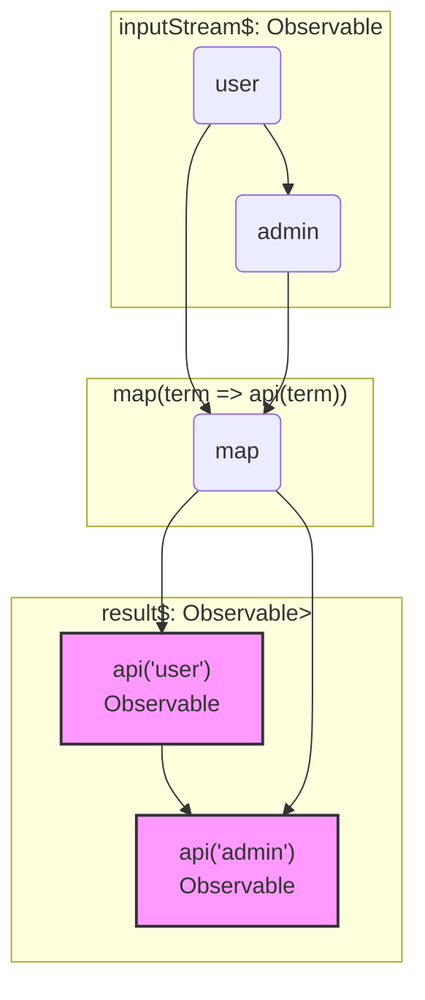
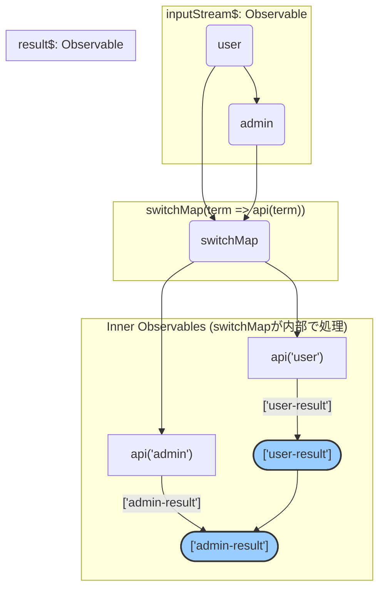
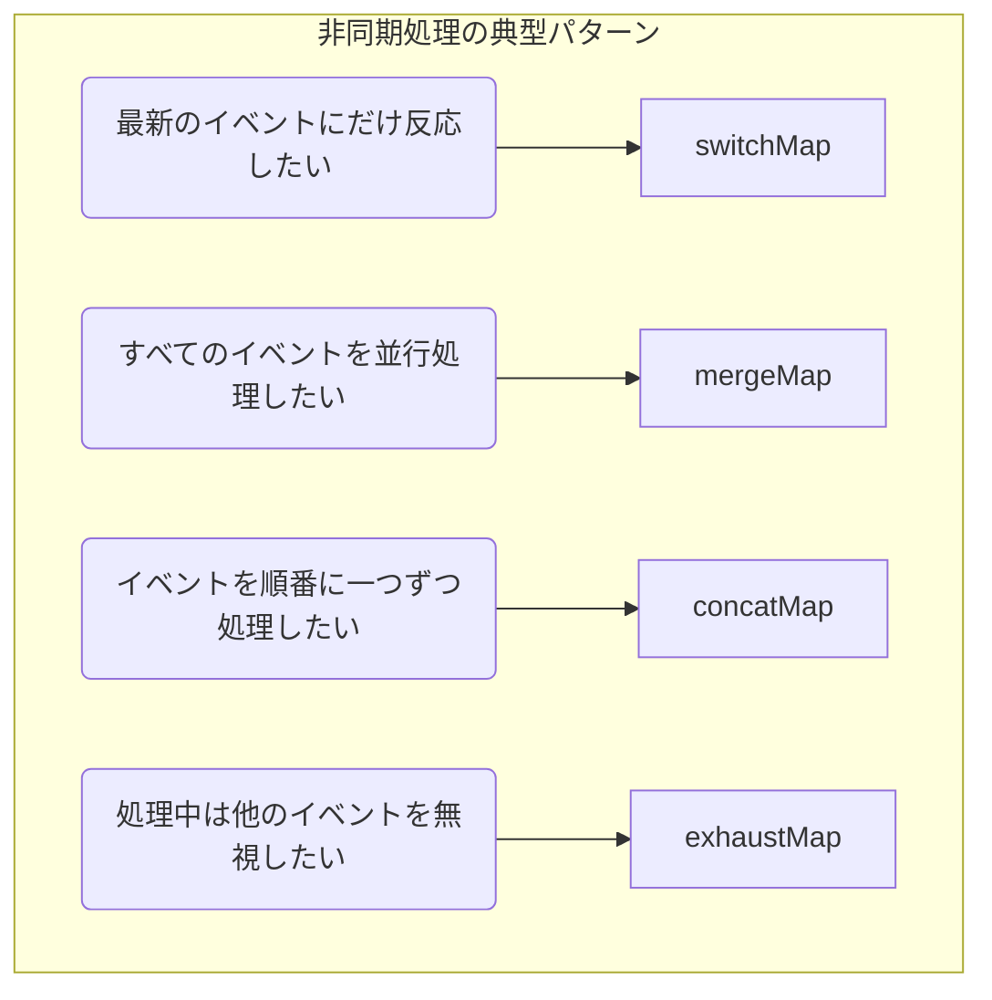

> [!NOTE]
> 本コンテンツは [RxJS入門](RxJS入門.md) の補足です。

### 1. 「`map` だと `Observable<Observable<any[]>>` になってしまう」のはなぜ？

この現象を理解するために、まず JavaScript の普通の配列の `map` から考えてみましょう。

##### ステップ1: 配列の `map` を思い出す

`map` は「箱の中身を一つずつ取り出して、別のものに変換して、同じ種類の箱に戻す」操作です。

```javascript
const numbers = [1, 2, 3];

// numbers (箱) から、中身の 1, 2, 3 を取り出し、
// それぞれを10倍した 10, 20, 30 に変換し、
// 再び配列 (同じ種類の箱) に戻す。
const multipliedNumbers = numbers.map(n => n * 10);
// 結果: [10, 20, 30]  <-- 型は `number[]` のまま
```

これは直感的ですね。`number` を `number` に変換したので、結果は `number[]` (numberの配列) です。

##### ステップ2: RxJS の `map` も基本は同じ

RxJS の `map` も全く同じ思想です。「`Observable` という箱の中を流れてくる値を、別の値に変換する」だけです。

```typescript
import { of } from 'rxjs';
import { map } from 'rxjs/operators';

// of('a', 'b', 'c') は 'a', 'b', 'c' という値を順番に流す Observable
const source$ = of('a', 'b', 'c'); // 型は Observable<string>

// source$ (箱) の中を流れてくる値 ('a', 'b', 'c') を
// それぞれ大文字 ('A', 'B', 'C') に変換する
const upperCase$ = source$.pipe(
  map(value => value.toUpperCase())
);

// 購読すると 'A', 'B', 'C' が流れてくる
// upperCase$ の型は Observable<string> のまま
upperCase$.subscribe(console.log);
```

ここまでは問題ないはずです。

##### ステップ3: 問題の発生 - `map` の中で `Observable` を返すとどうなるか？

ここが本題です。検索ボックスの例を思い出してください。「**入力値(文字列)を受け取って、その値でAPIを叩き、結果(配列)のObservableを返す**」という処理でした。

これを `map` で書くとどうなるでしょう？

```typescript
// 擬似的なAPI関数。文字列を受け取り、「結果の配列」のObservableを返す
function mockApiSearch(term: string): Observable<string[]> {
  return of([`${term}-result1`, `${term}-result2`]); // 擬似的なAPIレスポンス
}

// 入力ストリーム (例: 'user', 'admin')
const inputStream$ = of('user', 'admin'); // 型: Observable<string>

// ★問題のコード
const resultWithMap$ = inputStream$.pipe(
  map(term => mockApiSearch(term)) // string を Observable<string[]> に変換している
);
```

さあ、何が起きたか見てみましょう。
`map` のルールは「箱の中身を変換する」でした。

1.  `inputStream$` から最初の値 `'user'` (string) が流れてきます。
2.  `map` の中で `mockApiSearch('user')` が実行されます。
3.  `mockApiSearch` は何を返しましたか？ `['user-result1', 'user-result2']` という**配列**ではなく、その配列を流す **`Observable<string[]>`** を返しました。
4.  `map` は、この返ってきた **`Observable<string[]>`** を、そのまま `resultWithMap$` ストリームに流します。

つまり、`resultWithMap$` の中を流れている値は、もはや `string[]` ではなく、**`Observable<string[]>` という Observable そのもの**なのです。

これが **`Observable<Observable<string[]>>`** という「Observable の入れ子（ネスト）構造」が生まれる理由です。

**身近な例え：自動販売機**

*   **普通の `map`**: あなたは自販機に「100円玉」を入れる(`map`の入力)。自販機は「ジュース」を出す(`map`の出力)。
    *   入力: `コイン` -> 出力: `ジュース`
*   **入れ子になる `map`**: あなたは自販機に「100円玉」を入れる(`map`の入力)。ところがこの自販機は壊れていて、ジュースを出す代わりに **「隣のジュース自販機で使える専用トークン」** を吐き出した(`map`の出力)。
    *   入力: `コイン` -> 出力: `トークン`
    *   あなたはジュースが欲しいのに、手元にあるのはトークンです。このトークンをまた別の自販機に入れないと、最終的なジュースは手に入りません。この「トークン」が `Observable` であり、「トークンが入った状態」が `Observable<Observable<T>>` なのです。

この `Observable<Observable<T>>` をテンプレートで `| async` しようとしても、Angular は Observable オブジェクトそのものを表示しようとしてしまい、期待通りに動きません（`[object Object]` と表示されたりします）。

---

### 2. 「高階マッピング (Higher-Order Mapping)」とは何か？

`map` で発生した「Observable の入れ子問題」を解決してくれるのが、`switchMap` をはじめとする**高階マッピングオペレータ**です。

**高階 (Higher-Order)** という言葉は、「他のものを操作するもの」くらいの意味で捉えてください。
*   **高階関数**: 他の関数を引数に取ったり、関数を返したりする関数。
*   **高階 Observable**: 値として他の Observable を流す Observable (`Observable<Observable<T>>`)。
*   **高階マッピング**: 高階 Observable を扱って、内側の Observable を「平坦化 (flatten)」してくれるマッピング操作。

`switchMap` は、この「高階マッピング」を行うオペレータの代表格です。

**`switchMap` の仕事：賢い自動販売機**

先ほどの自販機の例えを続けましょう。

`switchMap` は非常に賢い自販機です。

1.  あなたは `switchMap` 自販機に「100円玉」を入れます（`switchMap` への入力）。
2.  `switchMap` は内部で `mockApiSearch` を呼び出し、「専用トークン (`Observable`)」を受け取ります。
3.  ここが `map` との決定的な違いです。`switchMap` はそのトークンをあなたに渡さず、**自動的に隣の自販機（内側のObservable）にそのトークンを入れて（`subscribe`して）、出てきた「ジュース」（最終的な値）をあなたに直接渡してくれます。**

つまり、`switchMap` は以下の2つの仕事を一手に引き受けてくれるのです。
1.  **マッピング**: 入力値を、新しい `Observable` に変換する。（`map` と同じ）
2.  **平坦化 (flatten)**: 新しく作られた内側の `Observable` を自動で購読し、その中から出てきた値だけを、元のストリームに流す。

##### 図で見る `map` と `switchMap` の違い

**`map` の場合（入れ子になる）**


*   `result$` には `Observable` そのものが流れているのがわかります。

**`switchMap` の場合（平坦化される）**


*   `switchMap` が内側の Observable (`api('user')`) を購読し、その結果 (`['user-result']`) だけを `result$` に流しているのがわかります。最終的なストリームは期待通りの `Observable<string[]>` となります。

##### `switchMap` のもう一つの重要な特徴：「切り替え (Switch)」

`switchMap` にはもう一つ、名前に由来する強力な機能があります。

**新しい入力が来たら、進行中の古い処理（内側のObservable）はキャンセルする**という機能です。

これは検索ボックスに最適です。ユーザーが "rxjs" と素早く入力した場合...

1.  `r` と入力 -> `apiService.search('r')` が開始
2.  `o` が入力される前に、`s` と入力 -> `apiService.search('rs')` が開始。この瞬間、**進行中だった `apiService.search('r')` のリクエストは自動的にキャンセルされます。**
3.  ...

これにより、不要になったAPIリクエストを自動で破棄し、常に最新の入力に対する結果だけを得ることができます。無駄な通信を防ぎ、パフォーマンスを向上させます。

### まとめ：`map` vs `switchMap`

|               | `map`                                                   | `switchMap`                                                               |
| :------------ | :------------------------------------------------------ | :------------------------------------------------------------------------ |
| **役割**        | 値から値への**同期的**な変換                                        | 値から **新しいObservable** への変換 ＋ **平坦化**                                      |
| **変換関数が返すもの** | 任意の値 (`string`, `number`, `object` など)                  | `Observable`                                                              |
| **戻り値の型**     | `Observable<T>` -> `Observable<R>`                      | `Observable<T>` -> `Observable<R>` (内部で `Observable<Observable<R>>` を平坦化) |
| **ユースケース**    | ・データ構造の整形<br>・プロパティの抽出<br>（例: `map(user => user.name)`) | ・イベントに応じてHTTPリクエストを実行する<br>・ある非同期処理の結果を使って、別の非同期処理を開始する                   |
| **特有の挙動**     | -                                                       | 新しい入力が来たら、前の内側Observableを**キャンセル**する                                      |

この解説で、「なぜ`map`だと入れ子になるのか」、そして「高階マッピング（特に`switchMap`）がその問題をどう解決するのか」という点が明確になったなら幸いです。この区別は、RxJSを扱う上で最も強力な武器の一つとなります。

---

> [!IMPORTANT]
> **質問**
> 検索ボックス例において、`switchMap` はピンポイントで都合がよすぎるオペレータという印象です。このために作ったのではないか。。と思うぐらい。言い換えれば汎用的な機能というよりも、特定のユースケースのために用意したオーダーメイドのような。この感覚は正しいのでしょうか？もしくは、一見特定、例外的に見えるこの状況が、実際には RxJSにおいて広くみられることなのでしょうか？

その感覚は、半分正しく、半分はさらに深い理解への入り口と言えます。`switchMap` が検索ボックスの例に「都合がよすぎる」ように見えるのは、まさにその通りです。しかし、それは`switchMap`がニッチな機能だからではなく、**「最新のイベントにのみ関心がある」という状況が、現代のUIプログラミングにおいて極めて一般的で、本質的なパターンだから**です。

ご指摘の点を深掘りし、`switchMap`がなぜオーダーメイドに見えつつも、実は非常に汎用的なのかを解説します。

---

### 1. 「都合がよすぎる」感覚は正しいか？ -> YES

おっしゃる通り、`switchMap` の挙動は、タイプアヘッド検索（入力予測検索）のようなユースケースに驚くほど完璧にフィットします。

*   **入力のたびに新しい非同期処理（APIリクエスト）を開始したい。**
*   **ユーザーの入力は断続的に発生する。**
*   **古い入力に対する結果はもはや不要。最新の入力に対する結果だけが欲しい。**
*   **途中のAPIリクエストが、後から来たリクエストより遅くレスポンスを返す可能性があり、結果の順序が狂うのを防ぎたい。**

これらの要件に対して、`switchMap` が提供する「**前の処理をキャンセルして、新しい処理に乗り換える(switchする)**」という機能は、まさにオーダーメイドのスーツのようにぴったりです。

この「完璧なフィット感」こそが、RxJS の設計思想の素晴らしさを示しています。つまり、**開発者が頻繁に直面するであろう非同期処理のパターンを的確に捉え、それを解決するための洗練された道具（オペレータ）として提供している**のです。

---

### 2. では、`switchMap` は特定ユースケース専用のニッチな機能か？ -> NO

ここからが重要なポイントです。「検索ボックス」という具体的な例は、`switchMap` が解決する**より抽象的で、より広範囲な問題パターン**の一例に過ぎません。

`switchMap` が本質的に解決するのは、以下のようなパターンです。

**「あるイベント（トリガー）をきっかけに非同期処理を開始するが、次のトリガーイベントが発生したら、進行中の処理はすべて破棄し、新しい処理に乗り換えたい」**

このパターンは、あなたが思っている以上に、アプリケーションの至る所に潜んでいます。

#### `switchMap` が活躍する、検索ボックス以外の広範なユースケース

*   **詳細ビューの表示**:
    *   **トリガー**: ユーザーがリスト内の別の項目をクリックする。
    *   **非同期処理**: クリックされた項目のIDを使って、APIから詳細データを取得する。
    *   **`switchMap`の役割**: ユーザーが素早くリスト項目を次々とクリックした場合、古いデータ取得リクエストはすべてキャンセルされ、最後にクリックされた項目のデータだけが確実に表示されます。これにより、UIが古いデータで一瞬表示されるといった不整合を防げます。

    ```typescript
    // selectedId$ はユーザーがクリックしたアイテムのIDを流すObservable
    this.itemDetails$ = this.selectedId$.pipe(
      switchMap(id => this.apiService.getItemDetails(id))
    );
    ```

*   **地図アプリケーション**:
    *   **トリガー**: ユーザーが地図をドラッグして表示範囲を変更し終える。
    *   **非同期処理**: 新しい表示範囲の情報を元に、そのエリアの店舗情報をAPIから取得する。
    *   **`switchMap`の役割**: ユーザーが地図をグリグリと動かしている間、中途半端な範囲でのAPIリクエストはキャンセルされ、ユーザーが手を離した最後の範囲に対するリクエストだけが実行されます。

*   **ライブデータの購読切り替え**:
    *   **トリガー**: ユーザーがドロップダウンから監視対象の株式銘柄を選択する。
    *   **非同期処理**: WebSocketに接続し、選択された銘柄の株価をリアルタイムで購読する。
    *   **`switchMap`の役割**: ユーザーが別の銘柄を選択すると、古い銘柄のWebSocket購読は自動的に切断（`unsubscribe`）され、新しい銘柄の購読にスムーズに切り替わります。`switchMap`は内側のObservableが完了する際に自動でクリーンアップ（`unsubscribe`など）を行ってくれます。

*   **認証状態に基づくデータ取得**:
    *   **トリガー**: ユーザーのログイン/ログアウト状態が変わる。
    *   **非同期処理**: ログイン状態なら、ユーザープロファイルをAPIから取得する。ログアウト状態なら、空のプロファイルを返す。
    *   **`switchMap`の役割**: `auth.user$` のようなObservableを監視し、ユーザーがログインしたらプロファイル取得を開始。もし何らかの理由で（トークン失効など）すぐにログアウト状態になったら、プロファイル取得処理はキャンセルされ、UIが不整合な状態になるのを防ぎます。

このように、`switchMap` が解決する「**最新のトリガーにのみ反応する**」というパターンは、UIの状態変化に応じて非同期データを扱う多くの場面で登場する、非常に**汎用的な問題**なのです。

---

### 3. 他の高階マッピングオペレータとの比較でわかる汎用性

`switchMap` がオーダーメイドではなく、非同期パターンを解決するツール群の一つであることは、他の高階マッピングオペレータと比較するとより明確になります。

| オペレータ | 挙動 | ユースケースの核心 | 例 |
| :--- | :--- | :--- | :--- |
| **`switchMap`** | 新しい入力が来たら、**前の処理をキャンセル**して新しい処理に乗り換える。 | **最新が正義**。古いものは不要。 | 検索、詳細表示、ライブ購読の切り替え |
| **`mergeMap`** (`flatMap`) | すべての入力に対して処理を開始し、**すべての処理を並行して実行**する。完了順序は問わない。 | **全部実行してほしい**。順序はどうでもいい。 | 複数のファイルを同時にアップロードする |
| **`concatMap`** | 入力の順序通りに処理を開始し、**前の処理が終わるまで次の処理を待つ**。 | **順番が絶対**。一つずつ確実に実行したい。 | フォームの保存リクエスト（1回目が終わらないと2回目を投げたくない） |
| **`exhaustMap`** | **処理が実行中の間は、新しい入力をすべて無視**する。 | **一度始めたら邪魔されたくない**。 | ログインボタンの連打防止 |

これらのオペレータは、それぞれが異なる非同期処理の典型的なパターンに対応しています。



このように見ると、`switchMap` は決して孤立した特殊な機能ではなく、**非同期処理の様々な要求（最新、並行、直列、無視）に応えるための、強力なツールボックスの中の一つ**であることがわかります。

### 結論

あなたの「都合がよすぎる」という感覚は、`switchMap` がいかに強力で、特定のパターンに美しい解決策を提供するかを的確に捉えています。

しかし、そのパターンは「検索ボックス」という具体的なユースケースに限定されるものではなく、**「最新の状態への追従」という、インタラクティブなアプリケーション開発における普遍的かつ頻出の課題**です。

したがって、あなたの感覚は次のように進化させると、より本質的な理解に繋がります。

*   **初期の感覚**: `switchMap` は、検索ボックスのような特定用途のために作られたオーダーメイドの機能だ。
*   **より深い理解**: `switchMap` は、「最新のイベントが常に優先される」という、UI開発で頻出する汎用的なパターンを解決するために設計された、極めて重要な基本ツールの一つだ。

RxJS を学ぶことは、こうした非同期処理の様々な「型」を知り、それに最適な「道具」を選べるようになることでもあります。その観点から、`switchMap` は最も重要な道具の一つと言えるでしょう。